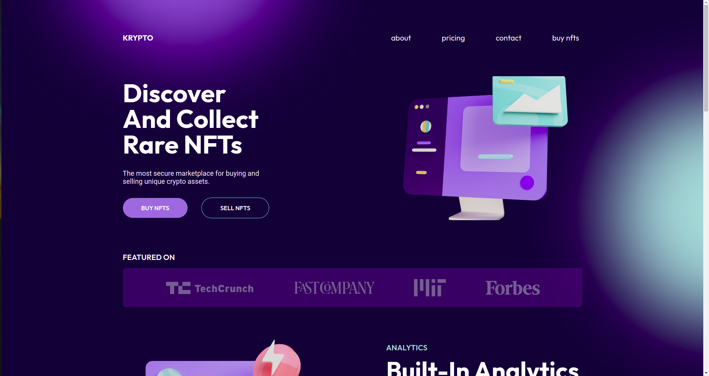
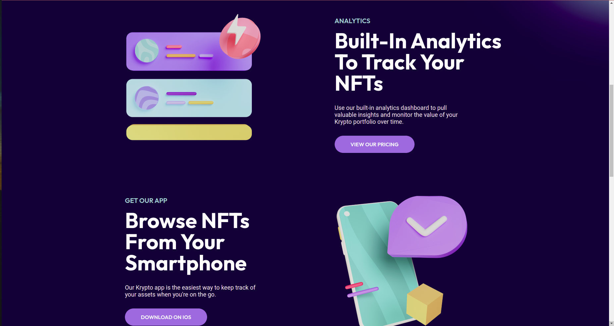

# Front-End Practice - UI/UX Design to Website

This is a Krypto NFTs market place landing page built from a Figma UI/UX design. The project was built to practice my Front-End web development skills by designing a landing page using Figma and then converting the design into a full web page using HTML5 & CSS3. 


## Overview

This is a practice project for my Front-End web development skills. The task is to try and design a landing page using Figma and then build the design into a full website. Here goes nothing ☺.

### The challenge

To reproduce the landing page of the website as closely as possible and implement all the UI designs from scratch if possible. Hence the tasks can be broken down into:
- Inspecting the page and downloading any resources needed
- Searching for any fonts and icons used on the page or any free alternatives on the internet
- Making sure the colors and animations looks as close to and smooth as the original

### Screenshots






### Links

1. Solution URL: [Solution on Github](https://github.com/Wandonium/krypto-nfts)
2. Live Site URL: [Live Site on Github pages](https://wandonium.github.io/krypto-nfts/)
3. UI/UX Design Tutorial: [Design Tutorial on YouTube](https://www.youtube.com/watch?v=HZuk6Wkx_Eg&list=PLpUfqJajYd0zmf2tleu3W48yVW1qj1FfW&index=3)
4. Figma Complete Design: [UI/UX Design on Figma](https://www.figma.com/file/2Mu3kLpLpmAWIE0MdbhTZ5/Flux---Figma-Build-Tutorial-Remix?node-id=0%3A1)

## My process

Break the web page into parts e.g. navbar, showcase etc. Then build each part as a HTML section each with it's own styling in a css class. Most of the styling was imported from the complete design already built in Figma.

### Built with

1. CSS custom properties
2. Flexbox
3. CSS Grid
4. JS window.onload function


### What I learned

Using the css blur() function to apply a Gaussian blur to a circle and make a great looking background.

```css
.bg-circle {
    width: 600px;
    height: 600px;
    border-radius: 50%;
    filter: blur(100px);
    z-index: -100;
}
```

How to create a hamburger navigation menu using a html button and css pseudo-elements along with some basic Javascript.

```css
.hamburger {
    position: relative;
    display: none;
    width: 35px;
    /* height: 35px; */
    cursor: pointer;
    appearance: none;
    background: none;
    outline: none;
    border: none;
}

.hamburger > .h-bar, .hamburger:after, .hamburger:before {
    content: '';
    display: block;
    width: 100%;
    height: 5px;
    background-color: #fff;
    margin: 6px 0px;
    transition: 0.4s;
}
```

## Author

1. Website - [Hillary Wando](http://hillarywando.com/)
2. Codepen - [@Wandonium](https://codepen.io/wandonium)
3. Twitter - [@hillarywando](https://www.twitter.com/hillarywando)
